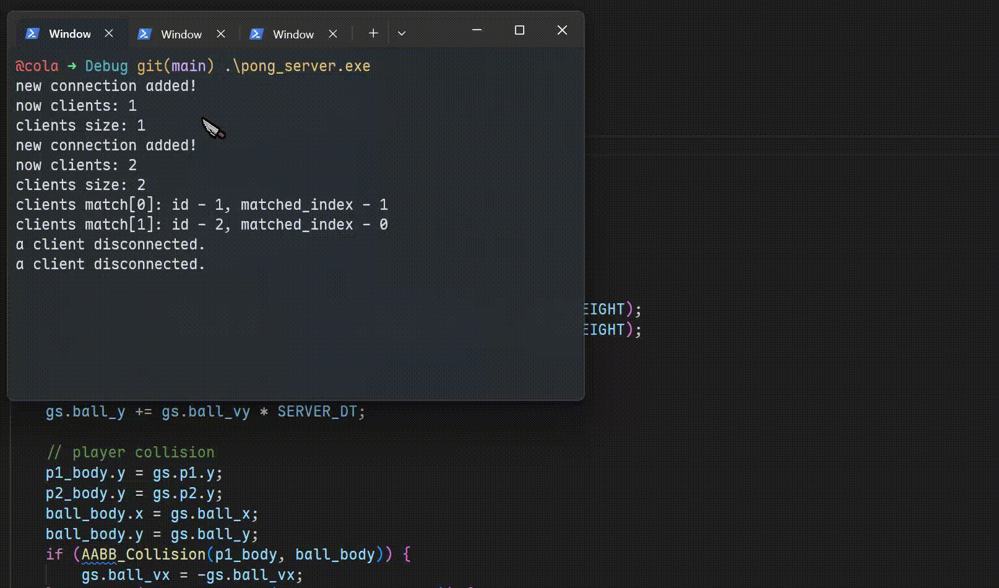
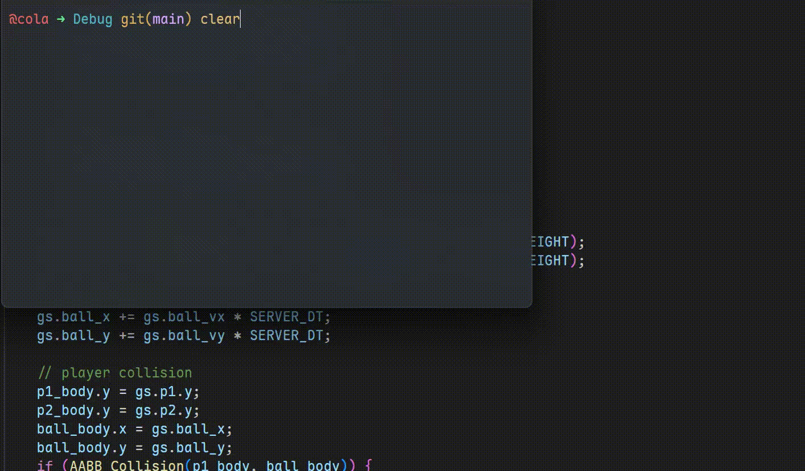

# PongNet  

A simple net pong game.  

## Compile  

I make this project on windows, use SDL3 and MinGW.

```bash
git clone https://github.com/saiumr/PongNet.git
cd PongNet
git submodule update --init --recursive
# `-G "MinGW Makefiles"` for windows MinGW compile tool
cmake -B build -S . -G "MinGW Makefiles" -DCMAKE_BUILD_TYPE=Debug
cmake --build build -j
cd build/Debug
```

## test

```bash
cd build
./pong_server.exe  # terminal window 0
./pong_net.exe     # terminal window 1, player 1, use w/s control
./pong_net.exe     # terminal window 2, player 2, use up/down arrow keys controlssssssssss
```

## online display  



## offline display  

Just run pong_net.exe (or pong_net).

  

## deploy to your own server  

At server.

Clone this project to your server and build it, then (maybe) you use following command run server.  

```bash
nohup ./pong_server > pong_server.log 2>&1 &
```

Find this process thread (get pid).  

```bash
ps -ef | grep pong_server
```

Kill it.  

```bash
kill [pid]
```

At client.

Change connecting ip(match to your server) in [pong_client.cpp](./src/pong_client.cpp#L12), then build it and execute.  


## New PongNet network design

Server authority model.  

Client:  

1. Predicting local input update result
2. Send client's inputs to server  
3. Interpolate the local results and server results (target values)  

Server:  

1. Process game updating logic on server  
2. Send result to each clients (I have paired the two clients that recently joined the server for communication)  

## PongNet network design (deprecated)

PongNet(Client)

- get input state (up/down)
- send input state to server every frame, send position per 30 frame
- receive server message
- update game data
- use multiple threads
- use message queue

PontNet(Server)

- collecting input state came from two clients
- ~~broadcast~~ convey input and position(p1->p2) to two clients(p2p)
